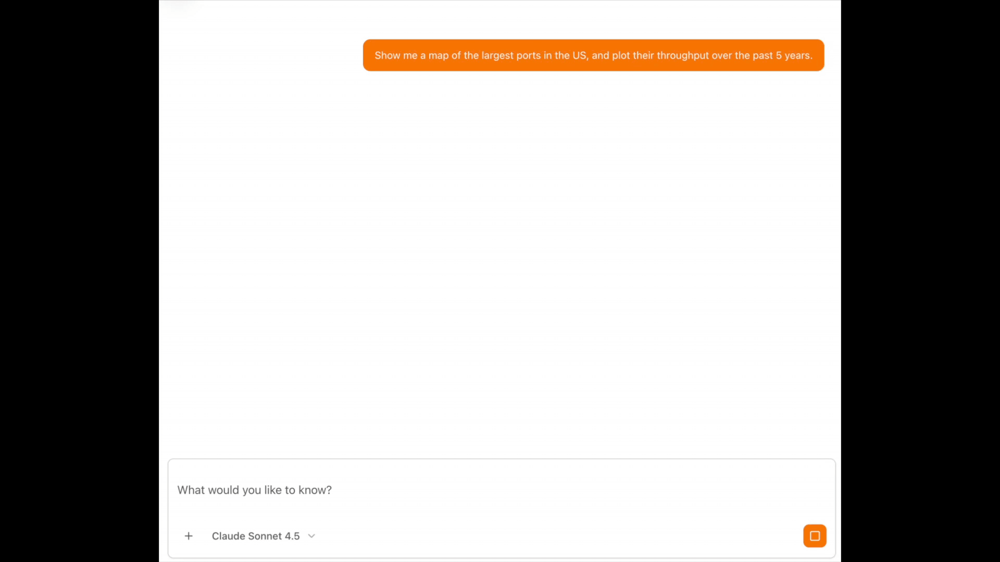

# Digital Operations Agent

An AI agent for industrial operations management with real-time data analysis, predictive maintenance, and operational decision support. Built with Next.js, AWS Amplify Gen 2, and AgentCore Runtime.



## Features

- **AgentCore Runtime Integration** — Agent hosted on AgentCore with streaming responses
- **Real-time Data Analysis** — Query operational data using natural language via GraphQL
- **Inline Visualizations** — Agent generates Plotly charts embedded in markdown via iframe srcdoc
- **Interactive Mapping** — MapLibre-based map viewer with query-driven layers
- **Amplify Data Integration** — GraphQL API with DynamoDB backend
- **Authentication** — Cognito OAuth2 with role-based access
- **Athena Integration** — Execute SQL queries against data lakes for map layers

## Architecture

```
┌─────────────────────────────────────────────────────────────┐
│                      Next.js Frontend                       │
│  ┌──────────────┐  ┌──────────────┐  ┌──────────────────┐  │
│  │ Chat UI      │  │ Map Viewer   │  │ Markdown         │  │
│  │ (streaming)  │  │ (MapLibre)   │  │ Renderer         │  │
│  └──────┬───────┘  └──────┬───────┘  └────────┬─────────┘  │
└─────────┼──────────────────┼───────────────────┼────────────┘
          │                  │                   │
          │                  │                   │ (iframes with
          │                  │                   │  srcdoc for plots)
          ▼                  ▼                   │
┌─────────────────┐  ┌──────────────────┐       │
│ AgentCore       │  │ Amplify Data     │       │
│ Runtime (HTTP)  │─▶│ (GraphQL API)    │       │
│                 │  │                  │       │
│ - Strands Agent │  │ - ChatSession    │       │
│ - Bedrock Model │  │ - ChatMessage    │       │
│ - GraphQL Tools │  │ - MapLayer       │       │
└─────────────────┘  │ - WorkoverJob    │       │
          │          │ - ActionItem     │       │
          │          └──────────────────┘       │
          │                  │                  │
          │                  ▼                  │
          │          ┌──────────────────┐       │
          │          │ DynamoDB Tables  │       │
          │          └──────────────────┘       │
          │                                     │
          ▼                                     │
┌─────────────────┐                            │
│ Amazon Bedrock  │                            │
│ (Nova 2 Lite)   │                            │
└─────────────────┘                            │
                                                │
┌───────────────────────────────────────────────┘
│
▼
Agent generates markdown with:
- Text content (markdown)
- Inline visualizations (iframe srcdoc with Plotly HTML)
- Map references (iframe src="/map")
```

## Prerequisites

- Node.js 20+
- AWS CLI configured with appropriate permissions
- Docker (for AgentCore Runtime local development)

## Quick Start

### Local Development

Start the Amplify sandbox (deploys backend resources):

```bash
npm install
npm run sandbox
```

In a separate terminal, start the Next.js dev server:

```bash
npm run dev
```

Open http://localhost:3000

### Deploy to AWS

This project must be deployed via AWS Amplify Hosting connected to a Git repository.

**Prerequisites:**
1. Fork this repository to your GitHub account
2. AWS account with Amplify permissions

**Deployment steps:**

1. Navigate to [AWS Amplify Console](https://console.aws.amazon.com/amplify/)
2. Click **New app** → **Host web app**
3. Connect your forked GitHub repository
4. Configure as monorepo:
   - Check **"My app is a monorepo"**
   - Set app root: `use-cases/digital-operations`
5. Set custom build image:
   - Go to **App settings** → **Build settings**
   - Select **Custom image**: `aws/codebuild/amazonlinux2-x86_64-standard:5.0`
6. Deploy

See [Amplify Deployment Guide](./docs/AMPLIFY_DEPLOYMENT_GUIDE.md) for detailed instructions.

## User Management

This application uses Cognito with admin-only user creation (self-signup is disabled). Users can only be created by administrators through two methods:

### Option 1: Using the createUser Script (Sandbox Deployments)

Best for local development with `npm run sandbox`.

Run the interactive script from the project directory:

```bash
cd use-cases/digital-operations
node scripts/createUser.js
```

The script will:
1. Read configuration from `amplify_outputs.json` (generated by sandbox)
2. Prompt for email address and temporary password
3. Create the user in Cognito with email verified
4. User must change password on first login

**Requirements:**
- AWS CLI installed and configured
- `amplify_outputs.json` file present in project root
- Running sandbox deployment (`npm run sandbox`)

### Option 2: Using AWS Console (Branch/CI-CD Deployments)

Best for Amplify Hosting deployments (production, staging, etc.).

1. Navigate to [Amazon Cognito Console](https://console.aws.amazon.com/cognito/)
2. Select the user pool created by Amplify
   - Find the user pool ID in Amplify Console → Backend environments
3. Click "Create user"
4. Enter email and temporary password
5. User will be prompted to change password on first login

**When to use:**
- Amplify Hosting deployments (Git-based CI/CD)
- Production or staging environments
- When `amplify_outputs.json` is not available locally

**Note:** Self-signup is intentionally disabled for security. All users must be created by administrators.

## Implementation

The agent uses Strands SDK with custom GraphQL tools and generates visualizations inline:

```typescript
// Agent with Bedrock model and GraphQL tools
const agent = new Agent({
  model: new BedrockModel({ 
    modelId: 'global.amazon.nova-2-lite-v1:0',
    region: 'us-east-1' 
  }),
  tools: [queryDataTool, createMapLayerTool, generateSuggestionsTool],
})

// System prompt instructs agent to generate visualizations
const systemPrompt = `
When responding:
- Create plots using <iframe srcdoc="..."> with Plotly HTML
- Only include data visualizations in iframe srcdoc
- Use markdown for all text, tables, and narrative content
- After creating map layers, render with <iframe src="/map">
`
```

### Visualization Approach

The agent generates two types of visualizations:

1. **Inline Charts** — Plotly charts embedded via `<iframe srcdoc="...">` containing complete HTML
2. **Interactive Maps** — MapLibre maps via `<iframe src="/map">` that load query-driven layers

Example agent response:

```markdown
## Throughput Analysis

Current throughput is 2,500 barrels/hour with predicted decline.

<iframe srcdoc="<html>...<script>Plotly.newPlot('chart', data, layout)</script>...</html>" 
        width="100%" height="600px"></iframe>

### Equipment Locations

<iframe src="/map" width="100%" height="600px"></iframe>
```

→ [Agent implementation](./amplify/agent/server/src/index.ts) | [GraphQL tools](./amplify/agent/server/src/tools/)

## Data Schema

Key operational data models:

- **ChatSession** — Conversation history with associated map layers
- **ChatMessage** — Individual messages with role, parts (text/tool calls), and metadata
- **MapLayer** — Query-driven map layers with Athena SQL, GeoJSON mapping, and styling
- **WorkoverJob** — Maintenance jobs with financial metrics and scheduling
- **ActionItem** — Recommended actions with status tracking
- **Settings** — System configuration including agent prompts

### Map Layer Architecture

Map layers are defined by Athena queries that return GeoJSON-compatible data:

```typescript
MapLayer {
  athenaQuery: string        // SQL query to generate features
  athenaDatabase: string     // Database for the query
  geoJsonMapping: {          // How to convert query results to GeoJSON
    geometryType: "Point" | "LineString" | "Polygon"
    longitudeField: string   // Column name for longitude
    latitudeField: string    // Column name for latitude
    propertyFields: string[] // Columns to include as properties
  }
  style: {                   // MapLibre styling
    color: string
    radius: number
    colorScale: { ... }      // Data-driven styling
  }
}
```

## Sample Queries

1. "Show me all workover jobs scheduled for this week"
2. "Create a map layer showing well locations colored by production rate"
3. "Generate a chart comparing actual vs predicted throughput"
4. "What action items are pending approval?"
5. "Create a heatmap of equipment failures over the last 30 days"

## Project Structure

```
├── amplify/
│   ├── agent/         # AgentCore Runtime agent implementation
│   ├── auth/          # Cognito authentication
│   ├── data/          # GraphQL schema and DynamoDB models
│   ├── functions/     # Lambda functions (Athena queries)
│   └── backend.ts     # Amplify backend configuration
├── src/
│   ├── app/           # Next.js pages
│   ├── components/    # React components
│   │   ├── ai-elements/  # AI-powered UI components
│   │   └── ui/           # Base UI components (shadcn/ui)
│   └── lib/           # Utilities (S3, Athena, HTML preprocessing)
└── docs/              # Documentation
```

## Key Technical Details

### AgentCore Integration

The agent runs on AgentCore Runtime and uses a custom transport layer to handle streaming:

- **Custom Transport** — `AgentCoreTransport` handles JWT authentication and streaming
- **GraphQL Tools** — Agent queries Amplify Data using generated GraphQL operations
- **Artifact Storage** — Charts and files uploaded to S3 with presigned URLs

### Amplify Deployment Considerations

- **Build Architecture** — Amplify uses x86, AgentCore requires ARM64 (uses QEMU emulation)
- **Streaming** — Custom transport required (Amplify SSR doesn't support HTTP streaming)
- **Timeouts** — AgentCore handles long-running operations (Amplify has 30s limit)

## Documentation

- [Amplify Deployment Guide](./docs/AMPLIFY_DEPLOYMENT_GUIDE.md)
- [AgentCore Agent Deployment](./docs/AGENTCORE_AGENT_DEPLOYMENT.md)
- [Athena Integration](./docs/ATHENA_INTEGRATION.md)
- [Customization Guide](./docs/CUSTOMIZATION_GUIDE.md)
- [Project Structure](./docs/PROJECT_STRUCTURE.md)
